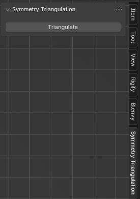
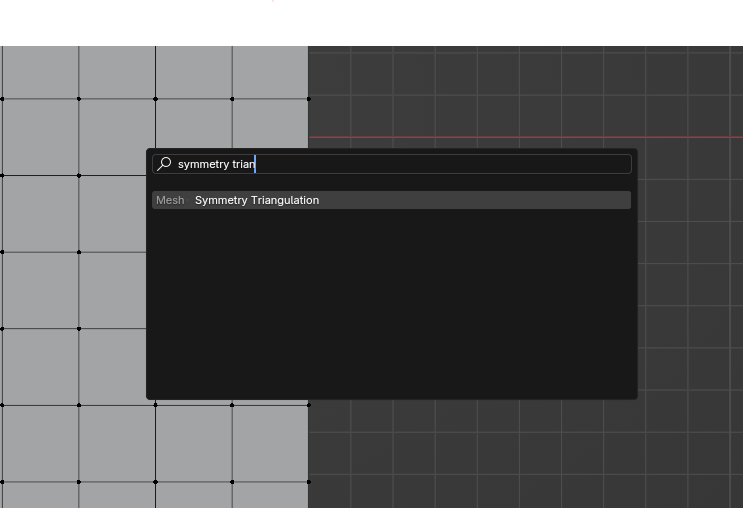
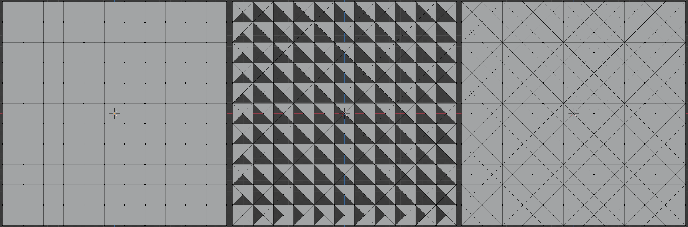
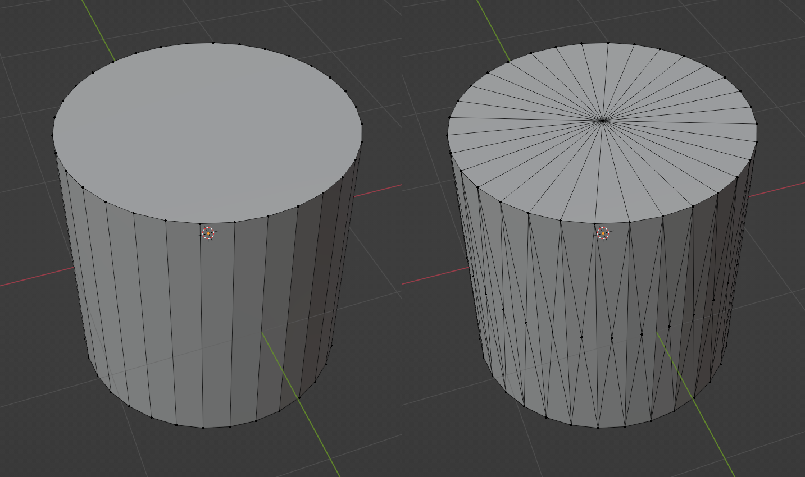

# Symmetry Triangulation

[Blender](https://blender.org) add-on to triangulate faces with more than 3 vertices symmetrically by adding a vertex at the center.

## Installation

1. Zip this repository in a `.zip` file or download a [release](https://github.com/voxell-tech/symmetry_triangulation/releases).
2. Open Blender, go to `Edit > Preferences > Add-ons > Install` and choose the `.zip` file.

## Usage

This add-on can be used in 2 ways:

### 3D View port

`Symmetry Triangulation` is available at the side bar of the 3D viewport.

### Edit Menu

You can also search for `Symmetry Triangulation` in the search menu in mesh edit mode.

## Results

*Note: Sometimes, the resulting triangulation might create wrong normals (as shown in the image above), when this happens, use `shift-n` to recalculate the normals.*

## License

This project is under the GNU Public License, Version 3.
